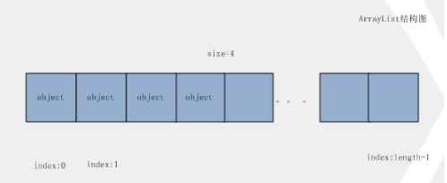
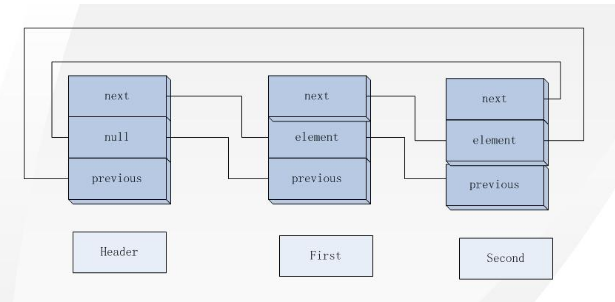

- Title: JAVA 集合常用类及数据结构
- Category:
- Tag: Java
- Author: Kahle
- Creation Time: 2018-12-31T14:25:19.666+0800
- Update Time: 2018-12-31T14:25:19.666+0800
- Original:
- Reference:

---

### 导语

JAVA 集合常用类及数据结构。

### List 

- ArrayList

    

    - ArrayList维护着一个对象数组。如果调用new ArrayList()后，它会默认初始一个size=10的数组。

    - 每次add操作都要检查数组容量，如果不够，重新设置一个初始容量1.5倍大小的新数组，然后再把每个元素copy过去。

    - 在数组中间插入或删除，都要移动后面的所有元素。（使用System.arraycopy()） 

- LindedList

    LinkedList的实现是一个双向链表。每个节点除含有元素外，还包含向前，向后的指针。

    新建一个LinkedList，生成一个头节点（header，就是一个头指针），它的元素为null。

    

    它自包含，next和previous指针都指向自己。 

    执行add(Object obj)方法后，会生成一个新节点，Header 节点的 next 指向链表的第一个节点，previous 指向链表的最后一个节点，在这里都是 first 。 

    再增加一个对象，它的形状像下面这样。 

    

    现在是一个标准的双向链表形状。每个节点都有自己的 next 和 previous 指针。 

    - 增加节点，只会对链表的指针进行操作，速度快

    - LinkedList实现了Deque，所以它有双向队列的特征，在链表两端可增删数据

    - 使用index查找对象时，会以index和size/2比较，从前或从后向中间搜索

    - ListIterator可向前或向后迭代

- 比较ArrayList和LinkedList的结构，就可以得出：

    - ArrayList的remove和add(index, Object)操作代价高，需要移动后面的每个元素。

    - LinkedList的get(index)操作代价高，它要先循环遍历list，找到Object

### Map

- HashMap

    HashMap的结构是一个散列桶，初始化时生成如下结构

    

    每个bucket包含一个Entry(map自定义的一种结构，包含一个往后的指针)的链表。

    在put(key, value)后，它的结构如下

    

    将key的hashcode再次散列，然后用这个hash和length-1进行按位与操作，得到bucket的index，然后检查当前bucket的链表，有没有这个key,如果有替换value，没有则跟在链表的最后。

    - 允许key和value都可以是null

    - Index=0的bucket存key=null的value，也可以是其它hashcode为0的项

    - 初始容量必须为2的幂次（我的理解是，在生成index的时候有这样的代码:hase ^ (length - 1)），length – 1的二进制代码为全1,则容易进行hash的设计）

    - 如果两个key散列后的index一样的话，第一个key生成的Entry先存在桶中，第二个key生成的Entry会将第一个Entry设为自己的next，串起来。（如图中，先put(yy, “first”)，会将这个Entry设为bucket的第一项，后put(xx,”second”)，则生成新Entry，它的next为key为yy的Entry，生成一个链表）

    - 在put操作中，会比较threshold（capacity * load_factor，一个临界值），如果size > threshold的话，生成一个当前bucket两倍数量的buckets，然后把现有的数据重新散列到新bucket中

    - 对HashMap迭代时，返回数据的顺序是:index从0到length-1，循环遍历每个bucket，把不为null的数据取出，每个bucket内的顺序由链表的顺序决定。而不是由插入数据决定。 

- LinkedHashMap

    上面说过，Map的迭代不由插入顺序决定。如果要保持这种顺序呢？就要新增加一种结构来保持。

    

    LinkedHashMap是HashMap的子类，增加一个双向链表，用来存储每个新加入的节点。在遍历时，按链表的顺序进行。其实差不多就是上面HashMap和LinkedList的和吧。

### Set

- HashSet

    HashSet使用HashMap来保持元素。Key = 元素，value是一个公有的对象，对每个元素都一样，在HashMap里面key是惟一的，当然很适合于构造set集合。等同于用HashMap包装了次，显示Set自己的特性。

